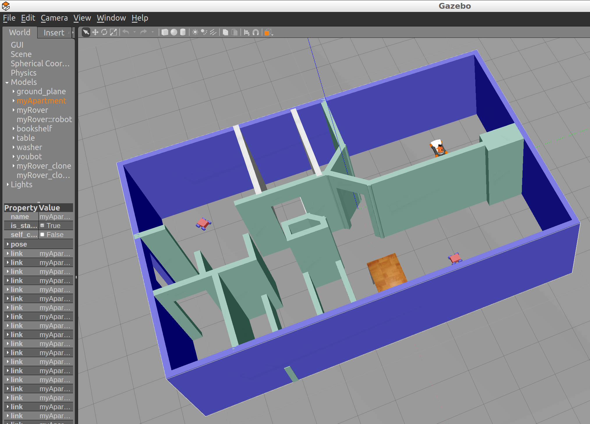

# Project 1 - Build My World



**Shown above:** A Gazebo world modelled after my apartment.

## Install
These instructions assume that the entire repo has been cloned. If not, refer to the repo README [here](https://github.com/SagarSaxena/Robotics-Nano-Degree/blob/master/README.md).

The build directory is already included in the repo, so the code does not need to be compiled again.

If the build directory was deleted or not cloned with the repo, create one:
```
$ cd ~/RoboNDProjects/Project1
$ mkdir build
$ cd build/
$ cmake ../
$ make
```

## Usage

Export the path of your build directory
`$ export GAZEBO_PLUGIN_PATH=${GAZEBO_PLUGIN_PATH}:/home/robond/RoboNDProjects/Project1/build`

Navigate to the world directory and launch `myWorld`:
```
$ cd ~/RoboNDProjects/Project1/world/
$ gazebo myWorld
```
A gazebo world modelled after my apartment will launch, with some robots scattered through out the environment.

One of the robots will move in a straight line until colliding with a wall, and a welcome message will be displayed on the terminal. Both actions are implemented as Gazebo plugins.

