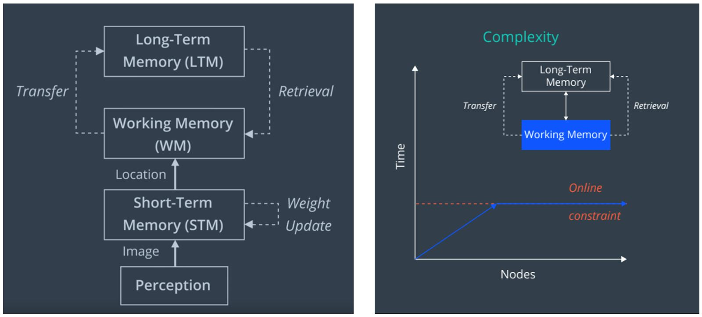
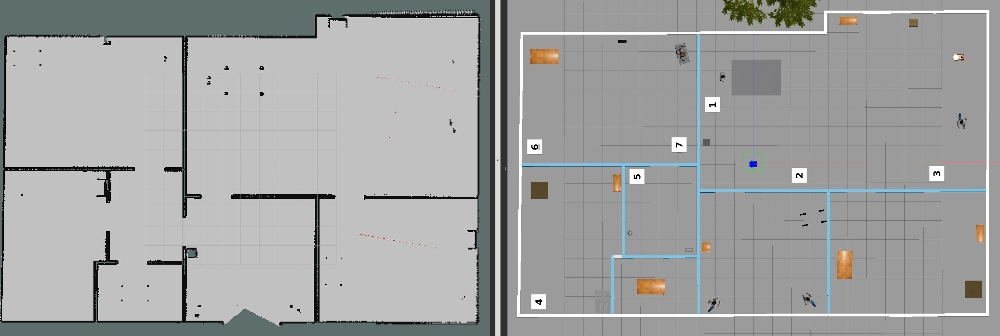
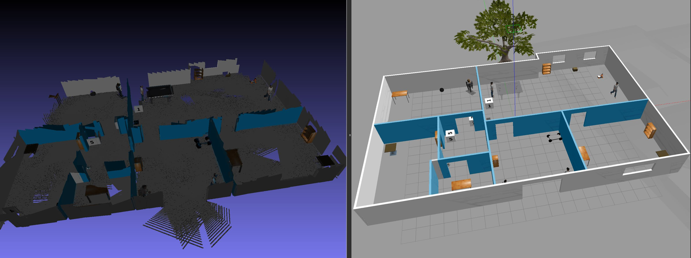

# Project 4 - Map My World

## Description

In this project Simultaneous Localization and Mapping (SLAM) is simulated using the [rtabmap_ros](http://wiki.ros.org/rtabmap_ros) package. RTAB-Map stands for Real Time Appearance Based Mapping, which is an implementation of the GraphSLAM algorithm that uses vision sensors. GraphSLAM uses a graph of features and poses connected through motion and sensing constraints (edges), and iteratively solves the resulting system of non-linear equations to find the most likely set of poses given the observations. It solves for the entire pose history and this is a Full SLAM solution. 

RTAB-Map uses a process called loop closure to determine if the robot has seen a location before. Loop closure typicaly results in much smoother maps and prevents the same features being registered as new ones. The feature detection and comparison used in loop closure uses the Visual Bag-of-Words technique. RTAB-Map is able to test loop closure in real time by using a memory management - the most recent and fequently observed location are kept in Working Memory (WM) of fixed size, and the others are trasnfered into Long-Term Memory (LTM). Loop closure is done only on WM making the time complexity of RTAB-Map constant (image below from Udacity Robotics Software NanoDegree).

 

## Results


**Shown above:** The generated occupancy grid map (left) versus a top view of the gazebo world.


**Shown above:** The generated 3D map (left) versus gazebo world (right). The same features can clearly be identified in both. Gaps in the 3D map are due to the robot not "looking" in that direction for long enough or at a close enough distance.

The database file can be downloaded [here](https://drive.google.com/file/d/1cTToWuMNFxYuCTSdDx6bDi9gL-te_gg-/view?usp=sharing)
The 3D map can be downloaded [here](https://drive.google.com/file/d/1iN_hZ49gvgl-BnHN_J86Vwvpu4mpAnir/view?usp=sharing)

## Install

Clone the repo:
```
$ git clone https://github.com/SagarSaxena/Robotics-Nano-Degree.git
```

Install the RTAB-Map binary:
```
$ sudo apt-get install ros-kinetic-rtabmap-ros
```

In the source directory for Project 4 clone the teleop-twist package
```
$ cd ~/Robotics-Nano-Degree/Project4/src
$ git clone https://github.com/ros-teleop/teleop_twist_keyboard
```

Compile the project:
```
$ cd ~/Robotics-Nano-Degree/Project4
$ catkin_make
```


## Launch

Open a terminal and launch the world:
```
$ cd ~/Robotics-Nano-Degree/Project4/
$ source devel/setup.bash
$ roslaunch my_robot world.launch
```

In another terminal launch the teleop node:
```
$ cd ~/Robotics-Nano-Degree/Project4/
$ source devel/setup.bash
$ rosrun teleop_twist_keyboard teleop_twist_keyboard.py
```

Finally, in a third terminal launch the mapping node:
```
$ cd ~/Robotics-Nano-Degree/Project4/
$ source devel/setup.bash
$ roslaunch my_robot mapping.launch
```

Once the map has been generated it can be used for localization. Open a terminal and enter
```
$ cd ~/Robotics-Nano-Degree/Project4/
$ source devel/setup.bash
$ roslaunch my_robot localization.launch
```

## Ouput

The generated map (db file) will be located in the `/root/.ros/` folder

The map db file can be viewed/analyzed in the `rtabmap-databaseViewer`
```
$ rtabmap-databaseViewer ~/.ros/rtabmap.db
```
